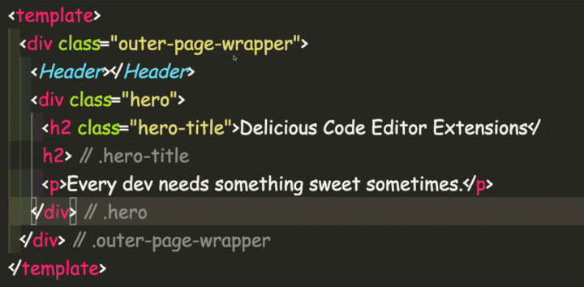

# HTML Biscuits

Use html-biscuits to make div soup and html spaghetti more digestible. Annotate ALL the end tags (that have relevant attributes)!!!

## Warning! Potential Plugin Conflict

In the current implementation, code-biscuits prevent seeing GitLens annotations. Issue can be tracked here:
[https://github.com/code-biscuits/html-biscuits/issues/2](https://github.com/code-biscuits/html-biscuits/issues/2)

## Configuration

- `html-biscuits.annotationColor` _string_ : Determines the color of annotation. Accepts any valid CSS color string.

  - default: vscode.ThemeColor("editorLineNumber.foreground"),

- `html-biscuits.annotationPrefix` _string_ : Determines beginning of the annotation text. Empty string is acceptable.

  - default: `"// "`,

- `html-biscuits.annotationMinDistance` _number_ : Determines the minimum amount of lines between start and end tag used to decide to show the annotations.

  - default: `0`,

- `html-biscuits.annotationMaxLength` _number_ : Determines the maximum amount of characters or words to show before truncating the biscuit text.

  - default: `0`,

- `html-biscuits.annotationTrimByWords` _boolean_ : Determines whether to trim max length by characters or words..
  - default: `false`,

## Commands

As we add more commands to change functionality on the fly, we will document them here.

### Toggle Biscuits

You are now able to toggle the biscuits on and off using the VSCode Command `HTML Biscuits: Toggle Biscuits Showing`.

## Release Notes

### 0.0.12

Add configuration for minimum line distance

### 0.0.11

Add configuration for Biscuit color

### 0.0.10

Add configuration for prefix

### 0.0.9

Switch to webpack instead of rollup

### 0.0.8

Try to fix deploy bugs from bundling refactor

## Attributions

- Logo: biscuit by Bartama Graphic from the Noun Project

## License

Copyright 2020 code-biscuits

Permission is hereby granted, free of charge, to any person obtaining a copy of this software and associated documentation files (the "Software"), to deal in the Software without restriction, including without limitation the rights to use, copy, modify, merge, publish, distribute, sublicense, and/or sell copies of the Software, and to permit persons to whom the Software is furnished to do so, subject to the following conditions:

The above copyright notice and this permission notice shall be included in all copies or substantial portions of the Software.

THE SOFTWARE IS PROVIDED "AS IS", WITHOUT WARRANTY OF ANY KIND, EXPRESS OR IMPLIED, INCLUDING BUT NOT LIMITED TO THE WARRANTIES OF MERCHANTABILITY, FITNESS FOR A PARTICULAR PURPOSE AND NONINFRINGEMENT. IN NO EVENT SHALL THE AUTHORS OR COPYRIGHT HOLDERS BE LIABLE FOR ANY CLAIM, DAMAGES OR OTHER LIABILITY, WHETHER IN AN ACTION OF CONTRACT, TORT OR OTHERWISE, ARISING FROM, OUT OF OR IN CONNECTION WITH THE SOFTWARE OR THE USE OR OTHER DEALINGS IN THE SOFTWARE.
